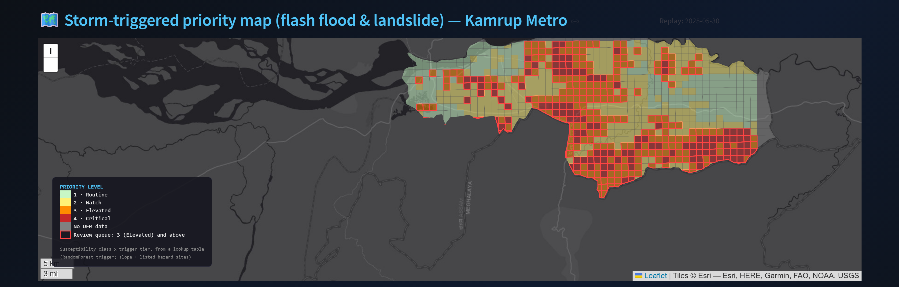
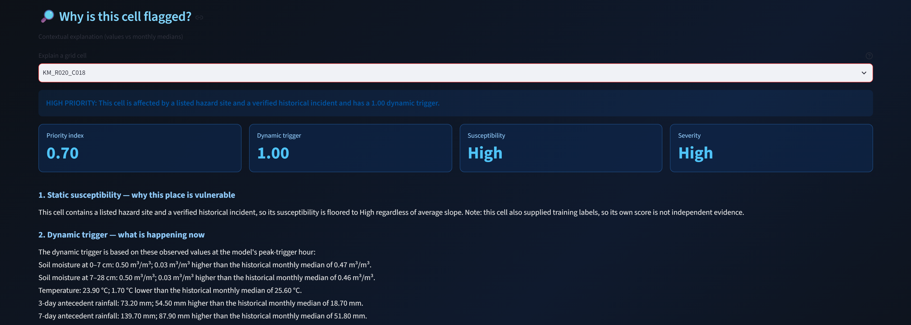
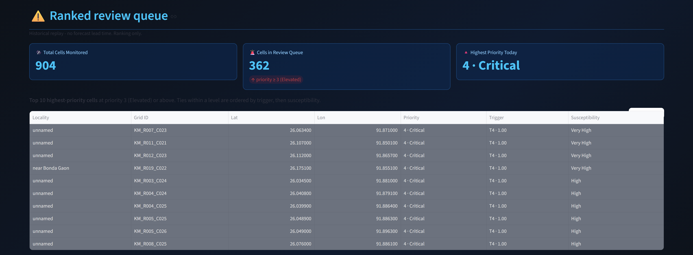

# PRAVAH

**Flash Flood Prediction System for Hilly Regions using Multi-Source Data**
Team Luit · Smart India Hackathon 2026 · Problem Statement PS26192 (Ministry of Home Affairs — Disaster Management)

*Hyper-local, proactive flash-flood and landslide early warning at 1 km resolution for hilly Guwahati.*

## Problem statement

Flash floods and rainfall-triggered slope failures in hilly terrain develop in hours, but
official warnings for districts like Kamrup Metropolitan are issued at district level and
often arrive too late to act on. There is no hyper-local, forward-looking picture of which
settlements are at risk on a given day. PRAVAH addresses that gap: it turns multi-source
rainfall, soil-moisture and terrain data into a per-cell risk forecast that can be issued
ahead of the event.

## What PRAVAH does

PRAVAH predicts rainfall-triggered flash-flood and slope-failure risk at **1 km grid
resolution** for the **Kamrup Metropolitan district** of Assam (Guwahati), and surfaces it
as an interactive risk map with a ranked early-warning list. The pilot grid covers **904
boundary-clipped cells (~796 km²)**, and risk can be rendered for any date from
**2018-01-01 to 2025-12-31**. It
replaces the current district-level, after-the-fact warning paradigm with cell-level,
proactive alerts.

## Architecture

The priority of each cell and date is a table lookup that combines one dynamic layer and
one static layer:

```
priority[cell, date] = PRIORITY_MATRIX[susceptibility class of cell][trigger tier of trigger_prob[weather_point(cell), date]]
```

The 4x4 matrix, the trigger-tier boundaries (T1 < 0.25, T2 0.25-0.50, T3 0.50-0.80,
T4 >= 0.80) and the review level live in `app/config.py`; the evidence for them is in
`docs/priority_matrix.md`.

- **Static susceptibility** is terrain-derived from 1 km mean slope, then *floored* to at
  least "High" for any cell containing a listed hazard site (news and official sources,
  per-row source in `data/raw/asdma_vulnerable_locations.csv`) **or** a dated-incident cell.
  The class (Low / Moderate / High / Very High) is one axis of the decision matrix.
- **Dynamic trigger** is a scikit-learn RandomForest (`n_estimators=100`,
  `class_weight='balanced'`) trained on five weather-point-level features —
  `soil_moisture_0_7`, `soil_moisture_7_28`, `temp_c`, `api_3d`, `api_7d` (soil moisture at
  two depths, temperature, and the 3-day / 7-day Antecedent Precipitation Index). Labels
  come from rainfall intensity–duration thresholds plus verified landslide/flood incidents.
- Trigger probabilities are precomputed by `build_trigger_cache.py`, so the app renders any
  date as a lookup, with no model call at demo time.

## Results and validation

Metrics reported are **PR-AUC** and **F1-macro**, from 5-fold `StratifiedGroupKFold`
cross-validation over storm-episode groups (61 storm episodes, 127 groups) — reproducible by
running `python app/evaluate_trigger_cv.py`. ROC-AUC is deliberately not reported — it is
misleading at the ~9% positive-class rate of this dataset. Fold-by-fold numbers, package
versions, and the commit this was run against are in
[`docs/evaluation_cv.json`](docs/evaluation_cv.json); label and split narrative is in
[`docs/model_training_log.md`](docs/model_training_log.md).

> **Void figures — do not cite.** PR-AUC/F1-macro of 0.8257 / 0.7640 (RandomForest) and
> 0.7504 / 0.8307 (XGBoost), which previously appeared here, were read off a single fold
> (fold 0) of one split, not a cross-validated estimate. They are superseded by the 5-fold
> means below; see `docs/evaluation_cv.json` for the reproducible source of every metric.

**Split — episode-grouped, not a temporal cutoff.** Rainfall-threshold labels make
temporally adjacent hours near-duplicates, so runs of active hours are merged into storm
episodes and the group key is `(year, episode_id)`; `StratifiedGroupKFold` keeps whole
episodes on one side of each fold, so **0 episode groups appear on both sides** (asserted
in code).

| Model | PR-AUC (mean ± sd, 5-fold) | F1-macro (mean ± sd, 5-fold) |
|---|---|---|
| **RandomForest** (shipped) | **0.798 ± 0.086** | 0.813 ± 0.061 |
| XGBoost | 0.792 ± 0.095 | **0.864 ± 0.059** |

Forward-in-time checks (train on years < Y, test on year Y) show both models degrading on
2025, the sparsest test year (RandomForest PR-AUC 0.552, XGBoost 0.590), while 2024 stays
close to the CV mean — see `temporal_2024` / `temporal_2025` in `docs/evaluation_cv.json`.

Labels: 2,627 positive cell-hours (2,459 rainfall-threshold + 7 dated incidents expanded to
168 incident-tagged cell-hours) against 26,270 stratified negatives (10:1), for a
28,897-row training set. 7 of 8 dated incidents are inside the weather record and used; the
16 Jul 2026 Lal Ganesh incident is excluded because it post-dates the record.

**Hazard-site overlap finding.** The listed hazard sites (news and official sources,
per-row source in `data/raw/asdma_vulnerable_locations.csv`) are mostly reported from
2022-23, before five of the six fatal incidents in our validation set. All 6
incident-containing grid cells fall within the listed hazard sites' cells — the
susceptibility floor (§8, `docs/model_training_log.md`) raises a cell to "High" if it
contains a listed hazard site **or** a dated-incident cell, whichever applies.

## Setup

```bash
pip install -r requirements.txt
```

## Getting the district boundary

`data/raw/boundaries/kamrup_metropolitan.geojson` is **not committed** to
this repository. It derives from [GADM](https://gadm.org) (v4.1, India,
admin level 2, feature `GID_2 = IND.4.15_1`) — GADM data is free to use for
academic and non-commercial purposes but [may not be
redistributed](https://gadm.org/license.html), which is why the file isn't
checked in. Every teammate fetches their own copy:

```bash
python scripts/fetch_boundary.py
```

This downloads GADM's India admin-level-2 dataset, filters it to Kamrup
Metropolitan, and writes `data/raw/boundaries/kamrup_metropolitan.geojson`.
Grid generation (`app.grid_utils.generate_grid`, notebook
`02_grid.ipynb`) raises a clear `FileNotFoundError` pointing back to this
command if the boundary file is missing.

## Regenerating the data

Run from the repository root, in order:

```bash
python build_susceptibility.py     # -> data/processed/susceptibility_features.parquet
python build_trigger_cache.py      # -> data/processed/trigger_prob_daily.parquet
```

## Running the app

Run from the repository root:

```bash
streamlit run app/streamlit_app.py
```

The sidebar provides a replay-date selector (historical dates, not a forecast), one-click
jumps to documented events, a minimum-priority selector for the review queue, and an
"Ingest Live IoT Telemetry" toggle. The main pane shows the full-width 1 km priority map and,
below it, the per-cell explanation panel and the ranked review queue.

## Visual walkthrough

Screenshots are regenerated by `venv\Scripts\python.exe scripts/capture_screenshots.py`,
all for 30 May 2025 (the Bonda landslide date, a historical replay).


*Priority map: each 1 km cell is coloured by its decision-matrix priority level (1 Routine to
4 Critical); a red outline marks the review queue.*


*"Why is this cell flagged?" for one cell: its susceptibility class, its trigger tier, the
priority the matrix gives them, and each feature's value against its historical monthly median.*


*Ranked review queue: cells at the review level or above, ordered by priority level, then
trigger, then susceptibility.*

Earlier screenshots showing the old multiplier formula were moved to
`docs/slides-assets/superseded_old_formula/` and must not be reused. There is no current
screenshot yet of the simulated IoT telemetry panel or the sidebar disclosure.

## Known limitations

- **Weather resolution.** Open-Meteo's ERA5-Land archive is natively ~9 km resolution;
  weather fields are nearest-neighbour-downscaled onto the 1 km grid, not genuine 1 km
  weather.
- **Simulated IoT telemetry.** No public village-level sensor network exists in India. The
  IoT panel demonstrates the ingestion interface a real MQTT feed would drop into; the data
  is simulated and disclosed as such in the UI.
- **Team-assigned decision matrix.** The matrix entries and tier boundaries are team
  judgements, not taken from a published study. The review level was chosen by a stated
  rule on training folds only (`docs/priority_matrix.md`); the labels contain no positive in
  a Moderate cell, so recall cannot vouch for Moderate cells being in the queue.
- **Partial DEM coverage.** 93 of the 904 cells lack DEM coverage; they get no priority
  and are rendered as grey "No Data", not as genuine low priority.
- **Single-district scope.** The system is built and validated for Kamrup Metropolitan
  only.

## Tech stack

Python · pandas · numpy · geopandas · rasterio · scikit-learn · XGBoost · SHAP · Streamlit ·
Folium · matplotlib · paho-mqtt (simulated feed)

## Team

Team Luit — Smart India Hackathon 2026.

- Sourav Chakraborty (Team lead)
- Akash Kalita
- Khomdram Sanahal
- Debjani Singha
- Shruti Laitonjam
- Samin Fiza Mutlib

