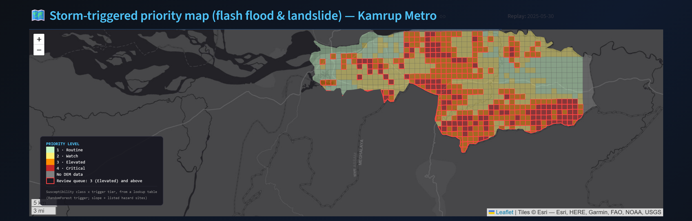
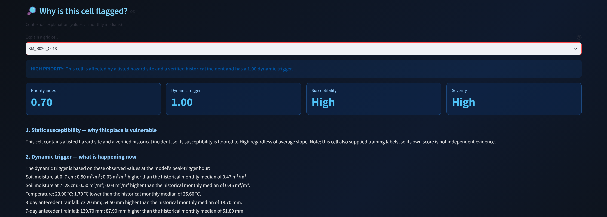
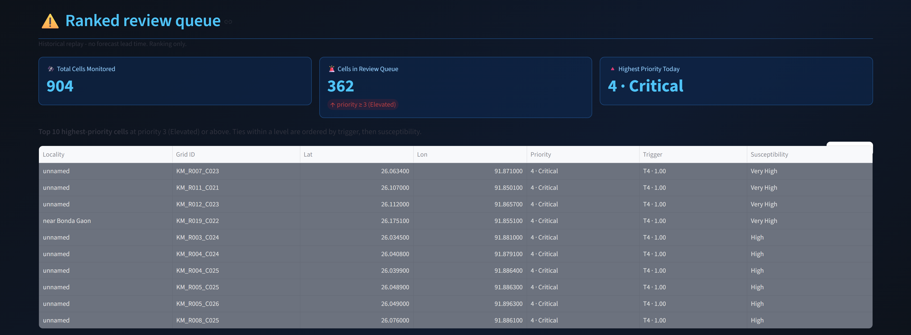

# PRAVAH

**Decision-support nowcast for the Kamrup Metropolitan pilot**  
Team Luit · Smart India Hackathon 2026 · Problem Statement SIH26192

PRAVAH displays a **historical replay of 2018–2025 ERA5-Land** as a cell-level,
ordinal priority index and review queue. It combines a five-feature RandomForest
storm trigger with terrain-derived susceptibility in a 4×4 decision matrix. This
prototype complements IMD FFGS, NESAC-ASDMA FLEWS and CWC C-FLOOD; it does not
replace them or establish an operational evacuation lead time.

**[Open the Streamlit app](https://pravah-luit.streamlit.app/)**

## What is built

- Historical replay map and ranked review queue for **904 one-km cells**: **811 scored**
  and **93 without DEM coverage**, shown as No Data, never low priority
  ([priority-matrix analysis](docs/priority_matrix.md)).
- RandomForest storm trigger on five rainfall, soil-moisture and temperature features;
  **5-fold storm-grouped CV PR-AUC 0.80** (no-skill 0.09), and **2025 year-ahead
  PR-AUC 0.55–0.59** (no-skill 0.055). These are proxy-label results, not incident
  detection results: **94% of positives** are rainfall-threshold proxies. See the
  [evaluation output](docs/evaluation_cv.json) and
  [training log](docs/model_training_log.md).
- **4×4** ordinal decision matrix with review at **level 3**. Nested-cut held-out
  episode recall is **42/63**; the shipped cut reaches **44/63**, versus **39/63**
  under the superseded rule. Replay workload: median **28 cells per alert day**
  (IQR **7–84**), **519 alert days of 2,922**; **460 cells** can reach review,
  versus **186** under the superseded rule
  ([priority-matrix output](docs/priority_matrix.md)).
- Hazard sites compiled from news reports with a source recorded per row in
  `data/raw/asdma_vulnerable_locations.csv`; this is **not an official ASDMA list**.
- **SIMULATED** sensor feed for demonstration.

## Next phase

- Validate evacuation lead time and incident outcomes independently.
- Build FastAPI and CAP 1.2 delivery, SACHET integration, real IoT ingestion and radar inputs.

## Scope / what we do not claim

Historical ERA5-Land replay is **not a forecast**. The trigger includes the current
hour, so its score is a same-storm nowcast, not a probability of flooding or a
validated early warning. The priority index is ordinal. Missing or stale inputs
must not be read as low priority. PRAVAH has **no validated evacuation lead time**;
incident results are reported separately from rainfall-threshold proxy results.

The existing [ECMWF retrospective backtest](docs/forecast_backtest.md) and
[exploratory diagnostics](docs/forecast_diagnostics.md) are preserved with the
[backtest](scripts/forecast_backtest.py) and
[diagnostic](scripts/forecast_diagnostics.py) scripts and the
[frozen configuration](docs/forecast_config.json). They do not establish a
validated evacuation lead time.

## Run locally

From the repository root, install `requirements.txt` in the project virtual environment,
fetch the district boundary as described below, then run:

```powershell
venv\Scripts\streamlit.exe run app/streamlit_app.py
```

## Architecture

The priority of each cell and date is a table lookup that combines one dynamic layer and
one static layer:

```
priority[cell, date] = PRIORITY_MATRIX[susceptibility class of cell][trigger tier of trigger_prob[weather_point(cell), date]]
```

The 4x4 matrix, the trigger-tier boundaries (T1 < 0.25, T2 0.25-0.50, T3 0.50-0.80,
T4 >= 0.80) and the review level live in `app/config.py`; the evidence for them is in
`docs/priority_matrix.md`.

- **Static susceptibility** is terrain-derived from 1 km mean slope, then *floored* to at
  least "High" for any cell containing a listed hazard site (compiled from news reports,
  per-row source in `data/raw/asdma_vulnerable_locations.csv`) **or** a dated-incident cell.
  The class (Low / Moderate / High / Very High) is one axis of the decision matrix.
- **Dynamic trigger** is a scikit-learn RandomForest (`n_estimators=100`,
  `class_weight='balanced'`) trained on five weather-point-level features —
  `soil_moisture_0_7`, `soil_moisture_7_28`, `temp_c`, `api_3d`, `api_7d` (soil moisture at
  two depths, temperature, and the 3-day / 7-day Antecedent Precipitation Index). Labels
  come from rainfall intensity–duration thresholds plus verified landslide/flood incidents.
- Trigger probabilities are precomputed by `build_trigger_cache.py`, so the app renders any
  date as a lookup, with no model call at demo time.

## Results and validation

Metrics reported are **PR-AUC** and **F1-macro**, from 5-fold `StratifiedGroupKFold`
cross-validation over storm-episode groups (61 storm episodes, 127 groups) — reproducible by
running `venv\Scripts\python.exe app/evaluate_trigger_cv.py`. ROC-AUC is deliberately not reported — it is
misleading at the ~9% positive-class rate of this dataset. Fold-by-fold numbers, package
versions, and the commit this was run against are in
[`docs/evaluation_cv.json`](docs/evaluation_cv.json); label and split narrative is in
[`docs/model_training_log.md`](docs/model_training_log.md).

> **Void figures — do not cite.** PR-AUC/F1-macro of 0.8257 / 0.7640 (RandomForest) and
> 0.7504 / 0.8307 (XGBoost), which previously appeared here, were read off a single fold
> (fold 0) of one split, not a cross-validated estimate. They are superseded by the 5-fold
> means below; see `docs/evaluation_cv.json` for the reproducible source of every metric.

**Split — episode-grouped, not a temporal cutoff.** Rainfall-threshold labels make
temporally adjacent hours near-duplicates, so runs of active hours are merged into storm
episodes and the group key is `(year, episode_id)`; `StratifiedGroupKFold` keeps whole
episodes on one side of each fold, so **0 episode groups appear on both sides** (asserted
in code).

| Model | PR-AUC (mean ± sd, 5-fold) | F1-macro (mean ± sd, 5-fold) |
|---|---|---|
| **RandomForest** (shipped) | **0.798 ± 0.086** | 0.813 ± 0.061 |
| XGBoost | 0.792 ± 0.095 | **0.864 ± 0.059** |

Forward-in-time checks (train on years < Y, test on year Y) show both models degrading on
2025, the sparsest test year (RandomForest PR-AUC 0.552, XGBoost 0.590), while 2024 stays
close to the CV mean — see `temporal_2024` / `temporal_2025` in `docs/evaluation_cv.json`.

Labels: 2,627 positive cell-hours (2,459 rainfall-threshold + 7 dated incidents expanded to
168 incident-tagged cell-hours) against 26,270 stratified negatives (10:1), for a
28,897-row training set. 7 of 8 dated incidents are inside the weather record and used; the
16 Jul 2026 Lal Ganesh incident is excluded because it post-dates the record.

**Hazard-site overlap finding.** The listed hazard sites (compiled from news reports,
per-row source in `data/raw/asdma_vulnerable_locations.csv`) are mostly reported from
2022-23, before five of the six fatal incidents in our validation set. All 6
incident-containing grid cells fall within the listed hazard sites' cells — the
susceptibility floor (§8, `docs/model_training_log.md`) raises a cell to "High" if it
contains a listed hazard site **or** a dated-incident cell, whichever applies.

## Setup

```bash
venv\Scripts\python.exe -m pip install -r requirements.txt
```

## Getting the district boundary

`data/raw/boundaries/kamrup_metropolitan.geojson` is **not committed** to
this repository. It derives from [GADM](https://gadm.org) (v4.1, India,
admin level 2, feature `GID_2 = IND.4.15_1`) — GADM data is free to use for
academic and non-commercial purposes but [may not be
redistributed](https://gadm.org/license.html), which is why the file isn't
checked in. Every teammate fetches their own copy:

```bash
venv\Scripts\python.exe scripts/fetch_boundary.py
```

This downloads GADM's India admin-level-2 dataset, filters it to Kamrup
Metropolitan, and writes `data/raw/boundaries/kamrup_metropolitan.geojson`.
Grid generation (`app.grid_utils.generate_grid`, notebook
`02_grid.ipynb`) raises a clear `FileNotFoundError` pointing back to this
command if the boundary file is missing.

## Regenerating the data

Run from the repository root, in order:

```bash
venv\Scripts\python.exe build_susceptibility.py     # -> data/processed/susceptibility_features.parquet
venv\Scripts\python.exe build_trigger_cache.py      # -> data/processed/trigger_prob_daily.parquet
```

## Running the app

Run from the repository root:

```bash
venv\Scripts\streamlit.exe run app/streamlit_app.py
```

The sidebar provides a replay-date selector (historical dates, not a forecast), one-click
jumps to documented events, a minimum-priority selector for the review queue, and an
"Show simulated sensor feed (demo)" toggle. The main pane shows the full-width 1 km priority map and,
below it, the per-cell explanation panel and the ranked review queue.

## Visual walkthrough

Screenshots are regenerated by `venv\Scripts\python.exe scripts/capture_screenshots.py`,
all for 30 May 2025 (the Bonda landslide date, a historical replay).


*Priority map: each 1 km cell is coloured by its decision-matrix priority level (1 Routine to
4 Critical); a red outline marks the review queue.*


*"Why is this cell flagged?" for one cell: its susceptibility class, its trigger tier, the
priority the matrix gives them, and each feature's value against its historical monthly median.*


*Ranked review queue: cells at the review level or above, ordered by priority level, then
trigger, then susceptibility.*

Earlier screenshots showing the superseded priority rule were moved to
`docs/slides-assets/superseded_old_formula/` and must not be reused. There is no current
screenshot yet of the simulated IoT telemetry panel or the sidebar disclosure.

## Known limitations

- **Weather resolution.** Open-Meteo's ERA5-Land archive is natively ~9 km resolution;
  weather fields are nearest-neighbour-downscaled onto the 1 km grid, not genuine 1 km
  weather.
- **Simulated IoT telemetry.** No public village-level sensor network exists in India. The
  IoT panel demonstrates the ingestion interface a real MQTT feed would drop into; the data
  is simulated and disclosed as such in the UI.
- **Team-assigned decision matrix.** The matrix entries and tier boundaries are team
  judgements, not taken from a published study. The review level was chosen by a stated
  rule on training folds only (`docs/priority_matrix.md`); the labels contain no positive in
  a Moderate cell, so recall cannot vouch for Moderate cells being in the queue.
- **Partial DEM coverage.** 93 of the 904 cells lack DEM coverage; they get no priority
  and are rendered as grey "No Data", not as genuine low priority.
- **Single-district scope.** The system is built and validated for Kamrup Metropolitan
  only.

## Tech stack

Python · pandas · numpy · geopandas · rasterio · scikit-learn · XGBoost · SHAP · Streamlit ·
Folium · matplotlib · paho-mqtt (simulated feed)

## TEAM

TODO (team lead): add the submitted team roster here.

