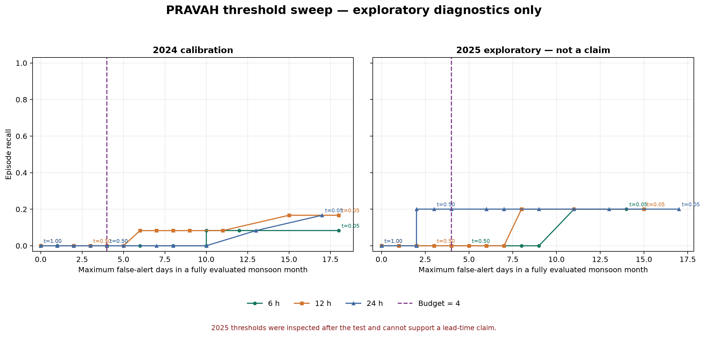

# PRAVAH exploratory forecast diagnostics

**EXPLORATORY DIAGNOSTIC — NOT A LEAD-TIME CLAIM.** These analyses were produced after the frozen evaluation. They do not change the threshold, JSON results, gate decision, or the conclusion that the lead time was not established.

The primary-latency diagnostic uses the preregistered 7-hour availability assumption, the cached pinned `ecmwf_ifs` runs, and the same 6, 12 and 24-hour alert schedule as the backtest. The 2025 threshold sweep is explicitly post-test sensitivity analysis.

## Input-distribution check

For each episode, the selected run is the run attached to the alert window that contains the episode onset. Forecast rainfall is then read from that same run at the exact forecast-aligned onset hour and weather point. Three-hour totals end at that hour. Values below are maxima across the slope-eligible cells positive at episode onset.

| Year | Episode | Onset (IST) | Lead | Actual issue-to-onset | Observed 1 h | Forecast 1 h | Observed 3 h | Forecast 3 h | Forecast crossed 20/60? |
|---:|---|---|---:|---:|---:|---:|---:|---:|---|
| 2024 | E0001 | 2024-05-13T06:00:00+05:30 | 6 h | 6 h | 22.8 mm | 0.3 mm | 23.0 mm | 0.3 mm | no |
| 2024 | E0001 | 2024-05-13T06:00:00+05:30 | 12 h | 18 h | 22.8 mm | 0.0 mm | 23.0 mm | 0.0 mm | no |
| 2024 | E0001 | 2024-05-13T06:00:00+05:30 | 24 h | 30 h | 22.8 mm | 0.3 mm | 23.0 mm | 1.9 mm | no |
| 2024 | E0002 | 2024-06-03T06:00:00+05:30 | 6 h | 6 h | 29.6 mm | 0.8 mm | 30.0 mm | 1.3 mm | no |
| 2024 | E0002 | 2024-06-03T06:00:00+05:30 | 12 h | 18 h | 29.6 mm | 4.2 mm | 30.0 mm | 5.3 mm | no |
| 2024 | E0002 | 2024-06-03T06:00:00+05:30 | 24 h | 30 h | 29.6 mm | 0.4 mm | 30.0 mm | 2.6 mm | no |
| 2024 | E0003 | 2024-06-07T02:00:00+05:30 | 6 h | 14 h | 20.6 mm | 0.2 mm | 24.5 mm | 0.8 mm | no |
| 2024 | E0003 | 2024-06-07T02:00:00+05:30 | 12 h | 14 h | 20.6 mm | 0.2 mm | 24.5 mm | 0.8 mm | no |
| 2024 | E0003 | 2024-06-07T02:00:00+05:30 | 24 h | 26 h | 20.6 mm | 0.1 mm | 24.5 mm | 0.1 mm | no |
| 2024 | E0004 | 2024-06-15T08:00:00+05:30 | 6 h | 8 h | 23.8 mm | 4.3 mm | 42.2 mm | 15.2 mm | no |
| 2024 | E0004 | 2024-06-15T08:00:00+05:30 | 12 h | 20 h | 23.8 mm | 1.0 mm | 42.2 mm | 9.2 mm | no |
| 2024 | E0004 | 2024-06-15T08:00:00+05:30 | 24 h | 32 h | 23.8 mm | 2.2 mm | 42.2 mm | 12.5 mm | no |
| 2024 | E0005 | 2024-06-17T11:00:00+05:30 | 6 h | 11 h | 20.7 mm | 8.4 mm | 34.7 mm | 18.6 mm | no |
| 2024 | E0005 | 2024-06-17T11:00:00+05:30 | 12 h | 23 h | 20.7 mm | 8.3 mm | 34.7 mm | 14.7 mm | no |
| 2024 | E0005 | 2024-06-17T11:00:00+05:30 | 24 h | 35 h | 20.7 mm | 9.7 mm | 34.7 mm | 11.2 mm | no |
| 2024 | E0006 | 2024-06-30T11:00:00+05:30 | 6 h | 11 h | 21.7 mm | 0.3 mm | 22.5 mm | 1.6 mm | no |
| 2024 | E0006 | 2024-06-30T11:00:00+05:30 | 12 h | 23 h | 21.7 mm | 0.3 mm | 22.5 mm | 0.9 mm | no |
| 2024 | E0006 | 2024-06-30T11:00:00+05:30 | 24 h | 35 h | 21.7 mm | 0.1 mm | 22.5 mm | 0.2 mm | no |
| 2024 | E0007 | 2024-07-01T05:00:00+05:30 | 6 h | 17 h | 21.0 mm | 2.6 mm | 32.8 mm | 5.1 mm | no |
| 2024 | E0007 | 2024-07-01T05:00:00+05:30 | 12 h | 17 h | 21.0 mm | 2.6 mm | 32.8 mm | 5.1 mm | no |
| 2024 | E0007 | 2024-07-01T05:00:00+05:30 | 24 h | 29 h | 21.0 mm | 0.4 mm | 32.8 mm | 0.6 mm | no |
| 2024 | E0008 | 2024-07-03T11:00:00+05:30 | 6 h | 11 h | 25.0 mm | 3.1 mm | 25.8 mm | 3.3 mm | no |
| 2024 | E0008 | 2024-07-03T11:00:00+05:30 | 12 h | 23 h | 25.0 mm | 0.4 mm | 25.8 mm | 0.9 mm | no |
| 2024 | E0008 | 2024-07-03T11:00:00+05:30 | 24 h | 35 h | 25.0 mm | 1.0 mm | 25.8 mm | 4.1 mm | no |
| 2024 | E0009 | 2024-07-12T09:00:00+05:30 | 6 h | 9 h | 25.4 mm | 0.3 mm | 40.9 mm | 1.4 mm | no |
| 2024 | E0009 | 2024-07-12T09:00:00+05:30 | 12 h | 21 h | 25.4 mm | 0.2 mm | 40.9 mm | 0.4 mm | no |
| 2024 | E0009 | 2024-07-12T09:00:00+05:30 | 24 h | 33 h | 25.4 mm | 0.6 mm | 40.9 mm | 4.8 mm | no |
| 2024 | E0010 | 2024-07-15T16:00:00+05:30 | 6 h | 16 h | 21.5 mm | 0.0 mm | 22.7 mm | 0.1 mm | no |
| 2024 | E0010 | 2024-07-15T16:00:00+05:30 | 12 h | 16 h | 21.5 mm | 0.0 mm | 22.7 mm | 0.1 mm | no |
| 2024 | E0010 | 2024-07-15T16:00:00+05:30 | 24 h | 28 h | 21.5 mm | 0.3 mm | 22.7 mm | 3.3 mm | no |
| 2024 | E0011 | 2024-07-22T03:00:00+05:30 | 6 h | 15 h | 34.1 mm | 0.4 mm | 49.2 mm | 3.9 mm | no |
| 2024 | E0011 | 2024-07-22T03:00:00+05:30 | 12 h | 15 h | 34.1 mm | 0.4 mm | 49.2 mm | 3.9 mm | no |
| 2024 | E0011 | 2024-07-22T03:00:00+05:30 | 24 h | 27 h | 34.1 mm | 2.5 mm | 49.2 mm | 4.9 mm | no |
| 2024 | E0012 | 2024-08-06T06:00:00+05:30 | 6 h | 6 h | 21.2 mm | 0.1 mm | 22.7 mm | 0.6 mm | no |
| 2024 | E0012 | 2024-08-06T06:00:00+05:30 | 12 h | 18 h | 21.2 mm | 2.3 mm | 22.7 mm | 8.7 mm | no |
| 2024 | E0012 | 2024-08-06T06:00:00+05:30 | 24 h | 30 h | 21.2 mm | 2.2 mm | 22.7 mm | 3.6 mm | no |
| 2025 | E0013 | 2025-05-30T15:00:00+05:30 | 6 h | 15 h | 22.1 mm | 4.5 mm | 55.2 mm | 16.2 mm | no |
| 2025 | E0013 | 2025-05-30T15:00:00+05:30 | 12 h | 15 h | 22.1 mm | 4.5 mm | 55.2 mm | 16.2 mm | no |
| 2025 | E0013 | 2025-05-30T15:00:00+05:30 | 24 h | 27 h | 22.1 mm | 4.2 mm | 55.2 mm | 14.7 mm | no |
| 2025 | E0014 | 2025-07-02T23:00:00+05:30 | 6 h | 11 h | 22.1 mm | 0.3 mm | 26.2 mm | 2.5 mm | no |
| 2025 | E0014 | 2025-07-02T23:00:00+05:30 | 12 h | 23 h | 22.1 mm | 0.8 mm | 26.2 mm | 2.2 mm | no |
| 2025 | E0014 | 2025-07-02T23:00:00+05:30 | 24 h | 35 h | 22.1 mm | 0.0 mm | 26.2 mm | 0.0 mm | no |
| 2025 | E0015 | 2025-07-20T11:00:00+05:30 | 6 h | 11 h | 24.2 mm | 0.1 mm | 41.6 mm | 0.3 mm | no |
| 2025 | E0015 | 2025-07-20T11:00:00+05:30 | 12 h | 23 h | 24.2 mm | 0.3 mm | 41.6 mm | 0.5 mm | no |
| 2025 | E0015 | 2025-07-20T11:00:00+05:30 | 24 h | 35 h | 24.2 mm | 1.9 mm | 41.6 mm | 3.3 mm | no |
| 2025 | E0016 | 2025-07-26T14:00:00+05:30 | 6 h | 14 h | 21.4 mm | 4.8 mm | 22.6 mm | 5.5 mm | no |
| 2025 | E0016 | 2025-07-26T14:00:00+05:30 | 12 h | 14 h | 21.4 mm | 4.8 mm | 22.6 mm | 5.5 mm | no |
| 2025 | E0016 | 2025-07-26T14:00:00+05:30 | 24 h | 26 h | 21.4 mm | 0.0 mm | 22.6 mm | 0.1 mm | no |
| 2025 | E0017 | 2025-08-24T11:00:00+05:30 | 6 h | 11 h | 28.4 mm | 12.6 mm | 41.8 mm | 13.1 mm | no |
| 2025 | E0017 | 2025-08-24T11:00:00+05:30 | 12 h | 23 h | 28.4 mm | 5.3 mm | 41.8 mm | 5.5 mm | no |
| 2025 | E0017 | 2025-08-24T11:00:00+05:30 | 24 h | 35 h | 28.4 mm | 2.1 mm | 41.8 mm | 11.4 mm | no |

Threshold crossings by nominal lead:

| Lead | Forecast crossed either rainfall threshold |
|---:|---:|
| 6 h | 0 of 17 episodes |
| 12 h | 0 of 17 episodes |
| 24 h | 0 of 17 episodes |
| Any of the three leads | 0 of 17 episodes |

The largest forecast 1-hour value was **12.6 mm**, versus **34.1 mm** observed: a forecast-to-observed extreme ratio of **0.370**. The largest forecast 3-hour value was **18.6 mm**, versus **55.2 mm** observed: a ratio of **0.337**. These ratios compare maxima across all available episode/lead pairs with maxima across the unique observed episodes; they are not mean bias estimates.

Plain result: **ECMWF HRES at roughly 9 km never reached either the 20 mm/1 h or 60 mm/3 h threshold at the onset of any ERA5-defined episode, at any tested lead.** ERA5 reached those thresholds by construction.

## 2024 threshold sweep

This is an exploratory view of the calibration period only. Recall uses raw district episode counts. The alert-budget coordinate is the maximum false-alert-day count among fully evaluated monsoon months, matching the frozen per-month constraint.

### Best 2024 recall at alternative monthly budgets

| Lead | Budget | Best recall | Threshold after frozen tie-break | Max false-alert days |
|---:|---:|---:|---|---:|
| 6 h | 4 days/month | 0 of 12 (0.0%) | 1.00 | 0 |
| 6 h | 8 days/month | 0 of 12 (0.0%) | 1.00 | 0 |
| 6 h | 15 days/month | 1 of 12 (8.3%) | 0.15 | 10 |
| 12 h | 4 days/month | 0 of 12 (0.0%) | 1.00 | 0 |
| 12 h | 8 days/month | 1 of 12 (8.3%) | 0.35 | 6 |
| 12 h | 15 days/month | 2 of 12 (16.7%) | 0.10 | 15 |
| 24 h | 4 days/month | 0 of 12 (0.0%) | 1.00 | 0 |
| 24 h | 8 days/month | 0 of 12 (0.0%) | 1.00 | 0 |
| 24 h | 15 days/month | 1 of 12 (8.3%) | 0.15 | 13 |

### Full 2024 sweep

| Lead | Threshold | Episode recall | 2024-05 | 2024-06 | 2024-07 | 2024-08 | 2024-09 | 2024-10 | Max in fully evaluated month |
|---:|---:|---:|---:|---:|---:|---:|---:|---:|---:|
| 6 h | 0.05 | 1 of 12 (8.3%) | 9 | 16 | 18 | 16 | 5 | 5 | 18 |
| 6 h | 0.10 | 1 of 12 (8.3%) | 7 | 10 | 11 | 12 | 3 | 3 | 12 |
| 6 h | 0.15 | 1 of 12 (8.3%) | 6 | 10 | 7 | 8 | 3 | 2 | 10 |
| 6 h | 0.20 | 0 of 12 (0.0%) | 4 | 10 | 6 | 8 | 3 | 2 | 10 |
| 6 h | 0.25 | 0 of 12 (0.0%) | 3 | 8 | 4 | 8 | 3 | 2 | 8 |
| 6 h | 0.30 | 0 of 12 (0.0%) | 2 | 6 | 3 | 6 | 1 | 1 | 6 |
| 6 h | 0.35 | 0 of 12 (0.0%) | 2 | 4 | 3 | 4 | 1 | 1 | 4 |
| 6 h | 0.40 | 0 of 12 (0.0%) | 2 | 4 | 3 | 4 | 1 | 1 | 4 |
| 6 h | 0.45 | 0 of 12 (0.0%) | 2 | 4 | 3 | 3 | 1 | 1 | 4 |
| 6 h | 0.50 | 0 of 12 (0.0%) | 2 | 4 | 3 | 3 | 0 | 1 | 4 |
| 6 h | 0.55 | 0 of 12 (0.0%) | 2 | 4 | 3 | 3 | 0 | 1 | 4 |
| 6 h | 0.60 | 0 of 12 (0.0%) | 2 | 4 | 2 | 2 | 0 | 1 | 4 |
| 6 h | 0.65 | 0 of 12 (0.0%) | 2 | 4 | 2 | 2 | 0 | 1 | 4 |
| 6 h | 0.70 | 0 of 12 (0.0%) | 2 | 3 | 1 | 1 | 0 | 1 | 3 |
| 6 h | 0.75 | 0 of 12 (0.0%) | 2 | 2 | 0 | 1 | 0 | 1 | 2 |
| 6 h | 0.80 | 0 of 12 (0.0%) | 2 | 0 | 0 | 1 | 0 | 1 | 2 |
| 6 h | 0.85 | 0 of 12 (0.0%) | 0 | 0 | 0 | 1 | 0 | 0 | 1 |
| 6 h | 0.90 | 0 of 12 (0.0%) | 0 | 0 | 0 | 1 | 0 | 0 | 1 |
| 6 h | 0.95 | 0 of 12 (0.0%) | 0 | 0 | 0 | 0 | 0 | 0 | 0 |
| 6 h | 1.00 | 0 of 12 (0.0%) | 0 | 0 | 0 | 0 | 0 | 0 | 0 |
| 12 h | 0.05 | 2 of 12 (16.7%) | 9 | 14 | 15 | 18 | 8 | 6 | 18 |
| 12 h | 0.10 | 2 of 12 (16.7%) | 8 | 11 | 13 | 15 | 5 | 4 | 15 |
| 12 h | 0.15 | 1 of 12 (8.3%) | 5 | 9 | 11 | 11 | 3 | 4 | 11 |
| 12 h | 0.20 | 1 of 12 (8.3%) | 4 | 8 | 9 | 8 | 2 | 4 | 9 |
| 12 h | 0.25 | 1 of 12 (8.3%) | 2 | 8 | 8 | 8 | 2 | 2 | 8 |
| 12 h | 0.30 | 1 of 12 (8.3%) | 2 | 6 | 6 | 7 | 0 | 2 | 7 |
| 12 h | 0.35 | 1 of 12 (8.3%) | 1 | 5 | 6 | 6 | 0 | 2 | 6 |
| 12 h | 0.40 | 0 of 12 (0.0%) | 1 | 5 | 4 | 4 | 0 | 2 | 5 |
| 12 h | 0.45 | 0 of 12 (0.0%) | 1 | 4 | 4 | 4 | 0 | 2 | 4 |
| 12 h | 0.50 | 0 of 12 (0.0%) | 1 | 3 | 3 | 3 | 0 | 0 | 3 |
| 12 h | 0.55 | 0 of 12 (0.0%) | 1 | 3 | 1 | 3 | 0 | 0 | 3 |
| 12 h | 0.60 | 0 of 12 (0.0%) | 1 | 2 | 1 | 3 | 0 | 0 | 3 |
| 12 h | 0.65 | 0 of 12 (0.0%) | 1 | 2 | 1 | 3 | 0 | 0 | 3 |
| 12 h | 0.70 | 0 of 12 (0.0%) | 1 | 1 | 0 | 3 | 0 | 0 | 3 |
| 12 h | 0.75 | 0 of 12 (0.0%) | 1 | 0 | 0 | 3 | 0 | 0 | 3 |
| 12 h | 0.80 | 0 of 12 (0.0%) | 1 | 0 | 0 | 3 | 0 | 0 | 3 |
| 12 h | 0.85 | 0 of 12 (0.0%) | 1 | 0 | 0 | 2 | 0 | 0 | 2 |
| 12 h | 0.90 | 0 of 12 (0.0%) | 0 | 0 | 0 | 2 | 0 | 0 | 2 |
| 12 h | 0.95 | 0 of 12 (0.0%) | 0 | 0 | 0 | 0 | 0 | 0 | 0 |
| 12 h | 1.00 | 0 of 12 (0.0%) | 0 | 0 | 0 | 0 | 0 | 0 | 0 |
| 24 h | 0.05 | 2 of 12 (16.7%) | 8 | 15 | 17 | 16 | 7 | 7 | 17 |
| 24 h | 0.10 | 1 of 12 (8.3%) | 4 | 11 | 12 | 13 | 5 | 5 | 13 |
| 24 h | 0.15 | 1 of 12 (8.3%) | 4 | 9 | 11 | 13 | 4 | 3 | 13 |
| 24 h | 0.20 | 0 of 12 (0.0%) | 2 | 4 | 9 | 10 | 2 | 3 | 10 |
| 24 h | 0.25 | 0 of 12 (0.0%) | 1 | 3 | 8 | 10 | 1 | 2 | 10 |
| 24 h | 0.30 | 0 of 12 (0.0%) | 1 | 2 | 7 | 8 | 1 | 2 | 8 |
| 24 h | 0.35 | 0 of 12 (0.0%) | 1 | 2 | 7 | 5 | 0 | 2 | 7 |
| 24 h | 0.40 | 0 of 12 (0.0%) | 1 | 1 | 5 | 4 | 0 | 2 | 5 |
| 24 h | 0.45 | 0 of 12 (0.0%) | 1 | 1 | 4 | 4 | 0 | 2 | 4 |
| 24 h | 0.50 | 0 of 12 (0.0%) | 1 | 1 | 4 | 4 | 0 | 2 | 4 |
| 24 h | 0.55 | 0 of 12 (0.0%) | 1 | 1 | 3 | 4 | 0 | 2 | 4 |
| 24 h | 0.60 | 0 of 12 (0.0%) | 1 | 0 | 3 | 4 | 0 | 1 | 4 |
| 24 h | 0.65 | 0 of 12 (0.0%) | 1 | 0 | 3 | 3 | 0 | 1 | 3 |
| 24 h | 0.70 | 0 of 12 (0.0%) | 1 | 0 | 1 | 2 | 0 | 1 | 2 |
| 24 h | 0.75 | 0 of 12 (0.0%) | 1 | 0 | 1 | 2 | 0 | 1 | 2 |
| 24 h | 0.80 | 0 of 12 (0.0%) | 1 | 0 | 1 | 1 | 0 | 1 | 1 |
| 24 h | 0.85 | 0 of 12 (0.0%) | 1 | 0 | 1 | 0 | 0 | 1 | 1 |
| 24 h | 0.90 | 0 of 12 (0.0%) | 0 | 0 | 0 | 0 | 0 | 0 | 0 |
| 24 h | 0.95 | 0 of 12 (0.0%) | 0 | 0 | 0 | 0 | 0 | 0 | 0 |
| 24 h | 1.00 | 0 of 12 (0.0%) | 0 | 0 | 0 | 0 | 0 | 0 | 0 |

## 2025 test-period sensitivity

**NOT A CLAIM; THRESHOLD WAS NOT SELECTED ON THIS DATA.** This table asks what the trade-off would look like if thresholds were inspected after seeing 2025. It cannot be used to revise the frozen threshold or establish a lead time.

### Best exploratory 2025 recall at alternative monthly budgets

| Lead | Budget | Best recall | Threshold after frozen tie-break | Max false-alert days |
|---:|---:|---:|---|---:|
| 6 h | 4 days/month | 0 of 5 (0.0%) | 1.00 | 0 |
| 6 h | 8 days/month | 0 of 5 (0.0%) | 1.00 | 0 |
| 6 h | 15 days/month | 1 of 5 (20.0%) | 0.10 | 11 |
| 12 h | 4 days/month | 0 of 5 (0.0%) | 1.00 | 0 |
| 12 h | 8 days/month | 1 of 5 (20.0%) | 0.20 | 8 |
| 12 h | 15 days/month | 1 of 5 (20.0%) | 0.20 | 8 |
| 24 h | 4 days/month | 1 of 5 (20.0%) | 0.55 | 2 |
| 24 h | 8 days/month | 1 of 5 (20.0%) | 0.55 | 2 |
| 24 h | 15 days/month | 1 of 5 (20.0%) | 0.55 | 2 |

### Full 2025 exploratory sweep

An asterisk marks August 2025, which is only partially evaluated; it is excluded from the maximum-full-month budget coordinate.

| Lead | Threshold | Episode recall | 2025-05 | 2025-06 | 2025-07 | 2025-08 | 2025-09 | 2025-10 | Max in fully evaluated month |
|---:|---:|---:|---:|---:|---:|---:|---:|---:|---:|
| 6 h | 0.05 | 1 of 5 (20.0%) | 14 | 13 | 14 | 12* | 5 | 0 | 14 |
| 6 h | 0.10 | 1 of 5 (20.0%) | 10 | 10 | 11 | 8* | 5 | 0 | 11 |
| 6 h | 0.15 | 0 of 5 (0.0%) | 7 | 6 | 9 | 6* | 3 | 0 | 9 |
| 6 h | 0.20 | 0 of 5 (0.0%) | 7 | 6 | 8 | 4* | 1 | 0 | 8 |
| 6 h | 0.25 | 0 of 5 (0.0%) | 7 | 6 | 6 | 3* | 1 | 0 | 7 |
| 6 h | 0.30 | 0 of 5 (0.0%) | 6 | 4 | 5 | 3* | 1 | 0 | 6 |
| 6 h | 0.35 | 0 of 5 (0.0%) | 6 | 4 | 5 | 3* | 1 | 0 | 6 |
| 6 h | 0.40 | 0 of 5 (0.0%) | 6 | 4 | 4 | 2* | 1 | 0 | 6 |
| 6 h | 0.45 | 0 of 5 (0.0%) | 5 | 3 | 3 | 2* | 1 | 0 | 5 |
| 6 h | 0.50 | 0 of 5 (0.0%) | 5 | 3 | 2 | 2* | 0 | 0 | 5 |
| 6 h | 0.55 | 0 of 5 (0.0%) | 5 | 2 | 2 | 2* | 0 | 0 | 5 |
| 6 h | 0.60 | 0 of 5 (0.0%) | 4 | 2 | 2 | 2* | 0 | 0 | 4 |
| 6 h | 0.65 | 0 of 5 (0.0%) | 4 | 2 | 2 | 1* | 0 | 0 | 4 |
| 6 h | 0.70 | 0 of 5 (0.0%) | 4 | 2 | 1 | 1* | 0 | 0 | 4 |
| 6 h | 0.75 | 0 of 5 (0.0%) | 3 | 2 | 1 | 0* | 0 | 0 | 3 |
| 6 h | 0.80 | 0 of 5 (0.0%) | 3 | 2 | 1 | 0* | 0 | 0 | 3 |
| 6 h | 0.85 | 0 of 5 (0.0%) | 2 | 1 | 1 | 0* | 0 | 0 | 2 |
| 6 h | 0.90 | 0 of 5 (0.0%) | 1 | 0 | 1 | 0* | 0 | 0 | 1 |
| 6 h | 0.95 | 0 of 5 (0.0%) | 0 | 0 | 0 | 0* | 0 | 0 | 0 |
| 6 h | 1.00 | 0 of 5 (0.0%) | 0 | 0 | 0 | 0* | 0 | 0 | 0 |
| 12 h | 0.05 | 1 of 5 (20.0%) | 14 | 11 | 15 | 14* | 7 | 4 | 15 |
| 12 h | 0.10 | 1 of 5 (20.0%) | 8 | 9 | 11 | 9* | 4 | 3 | 11 |
| 12 h | 0.15 | 1 of 5 (20.0%) | 7 | 8 | 8 | 7* | 3 | 2 | 8 |
| 12 h | 0.20 | 1 of 5 (20.0%) | 5 | 7 | 8 | 5* | 1 | 2 | 8 |
| 12 h | 0.25 | 0 of 5 (0.0%) | 5 | 6 | 7 | 4* | 1 | 2 | 7 |
| 12 h | 0.30 | 0 of 5 (0.0%) | 4 | 6 | 6 | 4* | 0 | 1 | 6 |
| 12 h | 0.35 | 0 of 5 (0.0%) | 4 | 6 | 6 | 4* | 0 | 0 | 6 |
| 12 h | 0.40 | 0 of 5 (0.0%) | 4 | 4 | 5 | 4* | 0 | 0 | 5 |
| 12 h | 0.45 | 0 of 5 (0.0%) | 3 | 2 | 4 | 4* | 0 | 0 | 4 |
| 12 h | 0.50 | 0 of 5 (0.0%) | 3 | 2 | 2 | 3* | 0 | 0 | 3 |
| 12 h | 0.55 | 0 of 5 (0.0%) | 2 | 2 | 2 | 2* | 0 | 0 | 2 |
| 12 h | 0.60 | 0 of 5 (0.0%) | 2 | 2 | 2 | 2* | 0 | 0 | 2 |
| 12 h | 0.65 | 0 of 5 (0.0%) | 1 | 1 | 2 | 1* | 0 | 0 | 2 |
| 12 h | 0.70 | 0 of 5 (0.0%) | 1 | 1 | 1 | 1* | 0 | 0 | 1 |
| 12 h | 0.75 | 0 of 5 (0.0%) | 1 | 1 | 0 | 1* | 0 | 0 | 1 |
| 12 h | 0.80 | 0 of 5 (0.0%) | 1 | 0 | 0 | 1* | 0 | 0 | 1 |
| 12 h | 0.85 | 0 of 5 (0.0%) | 1 | 0 | 0 | 1* | 0 | 0 | 1 |
| 12 h | 0.90 | 0 of 5 (0.0%) | 1 | 0 | 0 | 1* | 0 | 0 | 1 |
| 12 h | 0.95 | 0 of 5 (0.0%) | 0 | 0 | 0 | 0* | 0 | 0 | 0 |
| 12 h | 1.00 | 0 of 5 (0.0%) | 0 | 0 | 0 | 0* | 0 | 0 | 0 |
| 24 h | 0.05 | 1 of 5 (20.0%) | 11 | 15 | 17 | 13* | 7 | 3 | 17 |
| 24 h | 0.10 | 1 of 5 (20.0%) | 11 | 12 | 13 | 11* | 5 | 2 | 13 |
| 24 h | 0.15 | 1 of 5 (20.0%) | 8 | 11 | 11 | 9* | 5 | 2 | 11 |
| 24 h | 0.20 | 1 of 5 (20.0%) | 7 | 9 | 8 | 9* | 5 | 1 | 9 |
| 24 h | 0.25 | 1 of 5 (20.0%) | 7 | 7 | 5 | 8* | 2 | 1 | 7 |
| 24 h | 0.30 | 1 of 5 (20.0%) | 7 | 5 | 4 | 7* | 2 | 0 | 7 |
| 24 h | 0.35 | 1 of 5 (20.0%) | 6 | 4 | 3 | 7* | 2 | 0 | 6 |
| 24 h | 0.40 | 1 of 5 (20.0%) | 6 | 3 | 3 | 5* | 2 | 0 | 6 |
| 24 h | 0.45 | 1 of 5 (20.0%) | 4 | 3 | 3 | 4* | 2 | 0 | 4 |
| 24 h | 0.50 | 1 of 5 (20.0%) | 2 | 3 | 3 | 3* | 1 | 0 | 3 |
| 24 h | 0.55 | 1 of 5 (20.0%) | 2 | 2 | 2 | 3* | 0 | 0 | 2 |
| 24 h | 0.60 | 0 of 5 (0.0%) | 2 | 1 | 1 | 2* | 0 | 0 | 2 |
| 24 h | 0.65 | 0 of 5 (0.0%) | 2 | 1 | 1 | 1* | 0 | 0 | 2 |
| 24 h | 0.70 | 0 of 5 (0.0%) | 2 | 0 | 0 | 1* | 0 | 0 | 2 |
| 24 h | 0.75 | 0 of 5 (0.0%) | 2 | 0 | 0 | 1* | 0 | 0 | 2 |
| 24 h | 0.80 | 0 of 5 (0.0%) | 2 | 0 | 0 | 0* | 0 | 0 | 2 |
| 24 h | 0.85 | 0 of 5 (0.0%) | 0 | 0 | 0 | 0* | 0 | 0 | 0 |
| 24 h | 0.90 | 0 of 5 (0.0%) | 0 | 0 | 0 | 0* | 0 | 0 | 0 |
| 24 h | 0.95 | 0 of 5 (0.0%) | 0 | 0 | 0 | 0* | 0 | 0 | 0 |
| 24 h | 1.00 | 0 of 5 (0.0%) | 0 | 0 | 0 | 0* | 0 | 0 | 0 |

## Corrected uncertainty and raw counts

The episode-cluster percentile bootstrap is degenerate when every one of five binary outcomes is zero, which produced a misleading 0–0% interval in the frozen JSON. For descriptive uncertainty, this document uses the Wilson binomial interval. The lower bound remains zero, so this correction does not change any gate decision.

| Lead | Model recall | Wilson 95% interval | Baseline recall | Gate verdict |
|---:|---:|---:|---:|---|
| 6 h | 0 of 5 (0.0%) | 0.0%–43.4% | 0 of 5 (0.0%) | lead time not established |
| 12 h | 0 of 5 (0.0%) | 0.0%–43.4% | 0 of 5 (0.0%) | lead time not established |
| 24 h | 0 of 5 (0.0%) | 0.0%–43.4% | 0 of 5 (0.0%) | lead time not established |

## Coverage detail

The cache contains 751 usable scheduled runs and five explicit unavailable-run responses out of 756 expected runs. The unavailable runs are:

| Unavailable initialization (UTC) | Affected 6 h target date (IST) | Affected 12 h target date (IST) | Affected 24 h target date (IST) |
|---|---|---|---|
| 2025-08-05T00:00:00+00:00 | 2025-08-05 | 2025-08-06 | 2025-08-06 |
| 2025-08-06T00:00:00+00:00 | 2025-08-06 | 2025-08-07 | 2025-08-07 |
| 2025-08-08T00:00:00+00:00 | 2025-08-08 | 2025-08-09 | 2025-08-09 |
| 2025-08-08T12:00:00+00:00 | 2025-08-09 | 2025-08-09 | 2025-08-10 |
| 2025-08-09T00:00:00+00:00 | 2025-08-09 | 2025-08-10 | 2025-08-10 |

2025 target coverage at the primary latency:

| Lead | Complete scheduled targets | Target coverage | August status |
|---:|---:|---:|---|
| 6 h | 357 of 368 | 97.0% | partial: 51 of 62 targets complete |
| 12 h | 357 of 368 | 97.0% | partial: 51 of 62 targets complete |
| 24 h | 357 of 368 | 97.0% | partial: 51 of 62 targets complete |

Across the three lead tables there are **15 lead-specific targets** missing directly because a selected run is unavailable and **18 lead-specific targets** rejected because a required feature window is incomplete. August 2025 is therefore partial, while May, June, July, September and October are fully evaluated.

## Interpretation

The endpoint threshold of 1.0 looks degenerate, but the 2024 sweep shows that it was not the reason recall was zero under the frozen alert budget: at no tested threshold could any lead recover an episode while staying within four false-alert days in every monsoon month. Even at 15 false-alert days per month, the best calibration recall was only 1 of 12 at 6 hours, 2 of 12 at 12 hours, and 1 of 12 at 24 hours. Combined with the complete failure of forecast rainfall to reach the ERA5-defining thresholds, this supports a finding of no useful forecast-domain skill under the stated alert budget, rather than a calibration failure caused only by selecting 1.0. It does not prove that the ranking contains no signal at any alert rate. The 2025 sweep remains diagnostic only, and the frozen conclusion remains **lead time not established**.
